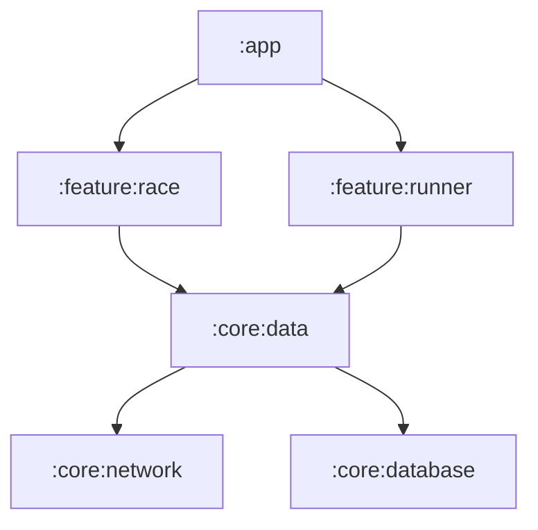

# README, changelog, architecture and versioned docs

Cross-cutting documentation that belongs to the repository rather than to a language toolchain. Each
section describes what can genuinely be derived from the codebase and what has to come from a human,
because conflating the two is how projects end up with a generated README nobody trusts.

## Contents

- [README](#readme)
- [Changelog](#changelog)
- [Architecture documentation](#architecture-documentation)
- [Versioned documentation sites](#versioned-documentation-sites)
- [Keeping docs from drifting](#keeping-docs-from-drifting)

## README

Read the package metadata first — name, description, version, license, repository, entry points, and
the dependency list say what the project is and how it is installed, which is most of the top half:

| Stack | Metadata source |
|---|---|
| Kotlin/Gradle | `settings.gradle.kts`, `build.gradle.kts` (`group`, `version`, `mavenPublish`) |
| Dart/Flutter | `pubspec.yaml` |
| Swift | `Package.swift`, `*.podspec` |
| Rust | `Cargo.toml` `[package]` |
| C++ | `CMakeLists.txt` `project()`, `conanfile.py` |
| JS/TS | `package.json` |
| Python | `pyproject.toml` `[project]` |

A structure that works for a library, in the order a newcomer needs it:

```markdown
# project-name

One sentence: what it is and who it is for.

## Install
<the real dependency line, with the real current version>

## Quick start
<the smallest example that does something useful — copied from a compiled example, not invented>

## Usage
<two or three real tasks, each with code>

## Configuration
<options table, derived from the config type or the CLI parser>

## Requirements
<language/SDK versions, platform support — from the build files>

## Contributing / License
<links, not prose>
```

Two rules that matter more than the structure:

- **Every code block in the README must have been run.** Untested README examples are the most
  common broken documentation in any repo, because nothing compiles them. Where the toolchain
  supports it, include the README in doc-tests (`#![doc = include_str!("../README.md")]` in Rust) or
  copy the block from an example that the build compiles.
- **Do not invent the "why".** Positioning, motivation, and comparisons to alternatives cannot be
  derived from code. Ask the user for one or two sentences, or leave the section out — a fabricated
  rationale is worse than a missing one and is the part readers remember.

For an application rather than a library, replace Install/Quick start with how to run it locally,
the environment variables it needs (names and purpose only — never values), and how to run the
tests.

## Changelog

Derivable only when the history has structure. Check first:

```bash
git describe --tags --abbrev=0                        # last release tag
git log --oneline "$(git describe --tags --abbrev=0)"..HEAD | head -50
git log --oneline -30 | grep -cE '^[0-9a-f]+ (feat|fix|docs|chore|refactor|perf|test)(\(.+\))?!?:'
```

If most commits match the conventional-commit pattern, generation is reliable. If they do not, say
so — a changelog built from "wip", "fixes", and "address review comments" is noise, and the honest
output is a list of merged pull request titles instead.

### Keep a Changelog format

```markdown
## [1.4.0] - 2026-07-31

### Added
- Streaming uploads for objects larger than 100 MiB (#231)

### Fixed
- Retry loop no longer aborts on a 429 without honouring `Retry-After` (#238)

### Changed
- `upload()` now returns the canonical URL rather than the signed one

### Deprecated / Removed / Security
- ...
```

Conventional commit types map onto those headings: `feat` → Added, `fix` → Fixed, `perf`/`refactor`
→ Changed, `BREAKING CHANGE:` or `!` → its own **Breaking changes** section at the top. `chore`,
`ci`, `style`, and `test` are usually omitted — they are invisible to users, which is who the
changelog is for.

That audience test decides the hard cases: write what changed *for someone using the software*, not
what changed in the repository. "Bumped kotlinx-serialization to 1.7.3" belongs in the changelog only
if it changes behavior a user can observe.

### Tools

```bash
git cliff --tag v1.4.0 --output CHANGELOG.md    # cliff.toml, conventional commits
npx conventional-changelog-cli -p angular -i CHANGELOG.md -s
```

`release-please` and `changesets` generate the changelog as part of the release PR instead — when
either is configured, do not hand-write entries, because the next release run will overwrite them.

Never invent an entry for a commit you cannot interpret. List it verbatim under an "Other" heading
and let the human classify it.

## Architecture documentation

The module graph is derivable; the reasoning behind it is not. Derive the structure, then ask the
user for the intent — an architecture doc that describes boxes without explaining why they are
separate has not told the reader anything they could not get from the directory listing.

Get the real graph from the build system rather than from directory names:

```bash
./gradlew projects                              # Gradle module list
./gradlew :app:dependencies --configuration implementation | grep -E '^\+--- project'
cargo tree --workspace --depth 1
flutter pub deps --style=compact
npx dependency-cruiser --output-type dot src | dot -Tsvg > docs/deps.svg
swift package show-dependencies --format json
```

Do not paste a full dependency tree into the document — they are enormous and unreadable. Extract
the first-party modules and their edges, and leave third-party dependencies to the lock file.

Render as Mermaid, since GitHub and most docs sites render it inline and it stays diffable in review:

````markdown

````

A useful architecture doc answers, in this order: what the layers are and what each may depend on;
where a request enters and what it touches on the way through; which decisions are load-bearing and
what they cost. The first is derivable, the second is traceable from the code, the third has to come
from whoever made the decision.

For a decision that is being made now rather than documented after the fact, an ADR is the right
format — one short file per decision, in `docs/adr/`, stating context, decision, and consequences.
Writing ADRs *with* the user is `doc-coauthoring`'s job, not this skill's.

For hand-drawn diagrams that are not derived from structure, use `draw-io-diagram-generator`.

## Versioned documentation sites

When docs are published per release, the version scheme has to match how the software is versioned,
or readers land on the wrong page:

| Tool | Versioning mechanism |
|---|---|
| MkDocs + `mike` | Deploys each version to a branch alias (`latest`, `1.4`) |
| Docusaurus | `docs/` is next, `versioned_docs/version-1.4/` snapshots |
| Sphinx + Read the Docs | Builds each tag/branch automatically |
| Dokka / DocC / rustdoc | No built-in versioning — publish per tag into a versioned path |

Two things to get right: pin a `latest`/`stable` alias that the canonical URL points at, so external
links do not rot; and snapshot the docs at release time rather than rewriting old versions, since
back-editing published docs breaks the guarantee that a version's docs match that version's code.

## Keeping docs from drifting

The point of deriving docs from code is that drift becomes detectable. Make it detectable in CI:

- **Fail the build on doc warnings** once the backlog is clear — `-W` for Sphinx, `--strict` for
  MkDocs, `failOnWarning` for Dokka, `#![deny(rustdoc::broken_intra_doc_links)]` for Rust,
  `FAIL_ON_WARNINGS` for Doxygen.
- **Run the executable examples** — doc-tests, Go example functions, doctests, `@sample` compilation.
  These fail loudly at exactly the moment the API changes.
- **Lint the OpenAPI spec** in the same job that builds the API docs.
- **Regenerate and diff** for generated Markdown checked into the repository, so a stale file fails
  review instead of shipping.

Do not add all of these at once to a project that has none. Introducing a strict doc gate across an
undocumented codebase turns every unrelated pull request red, which gets the gate disabled. Start
with the executable examples — they have the highest signal and the smallest backlog.
